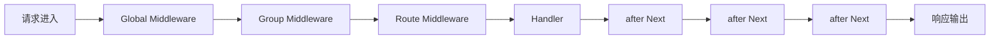

# Gin 框架项目代码规范

## 执行摘要

本规范文件严格基于 gin-gonic.com 官方文档与示例代码，抽象为团队可直接执行的 Gin 项目代码规范，覆盖项目结构、路由与版本化、处理器签名与参数绑定校验、中间件与错误处理、日志与运行配置、测试与安全基线等主题。核心要求包括：按资源组织路由并使用 `*gin.RouterGroup` 注册（便于扩展与分组中间件复用）、采用一致的 API 响应封装与错误码体系、输入绑定优先使用 `ShouldBind*` 以避免框架默认 abort 行为破坏统一错误响应、在中间件中清晰区分 `c.Next()` 前后逻辑并在异步 goroutine 场景使用 `c.Copy()`、生产环境强制启用 Release Mode、可信代理（Trusted Proxies）与安全 Cookie/Session 选项，以及标准化的测试模板（httptest + TestMode）。

## 研究范围与来源约束

本报告的检索与引用严格限定在 gin-gonic.com：所有规范项的依据均来自官方 Docs/FAQ 中的 Routing、Binding、Middleware、Logging、Server Configuration、Testing 等页面，并在每条规范项中给出对应“官方原始链接”（仅 gin-gonic.com）。citeturn4search4turn31view0

你未指定的维度按要求视为“无特定约束”。因此，本规范仅固化 gin-gonic.com 明示或通过官方示例体现的“代码书写与组织标准”；对 Go 语言通用风格、团队工程体系（CI、Lint、代码生成、提交规范）不额外强制。

## 项目结构与依赖注入

### 规范项

**PS-A 路由必须按资源拆分并提供注册函数，入参为 `*gin.RouterGroup`**

```go
// routes/users.go
func RegisterUserRoutes(rg *gin.RouterGroup) {
    users := rg.Group("/users")
    users.GET("/", listUsers)
    users.POST("/", createUser)
    users.GET("/:id", getUser)
    // ...
}

// router 初始化处
api := r.Group("/api/v1")
RegisterUserRoutes(api)
```

解释：官方在 API 设计模式中明确建议：随着 API 增长，应按资源组织路由，每个资源一个文件，并提供“把该资源所有端点注册到 RouterGroup 上”的函数。这种组织方式能让资源解耦、便于模块化增删，同时天然支持对某一资源组挂载统一中间件（鉴权、审计、限流等）。
官方链接：`https://gin-gonic.com/en/docs/routing/api-design/`

**DI-A 小中型项目优先使用闭包注入依赖（编译期类型安全、易测试）**

```go
func GetUserHandler(svc *UserService) gin.HandlerFunc {
    return func(c *gin.Context) {
        id := c.Param("id")
        // svc.GetUser(c.Request.Context(), id)
    }
}
```

解释：官方将闭包注入描述为更符合 Go 风格的方式：处理器显式声明依赖，天然便于在测试中注入替身（mock/fake），并保持编译期类型安全。
官方链接：`https://gin-gonic.com/en/docs/middleware/dependency-injection/`

**DI-B 依赖较多时使用结构体聚合处理器（保持签名一致、便于组织）**

```go
type App struct {
    DB     *sql.DB
    Logger *slog.Logger
}

func (a *App) GetUser(c *gin.Context) {
    id := c.Param("id")
    // a.DB.QueryRowContext(c.Request.Context(), ...)
}
```

解释：官方示例给出 struct-based handlers：将数据库、配置、日志等依赖收敛到结构体，路由注册直接绑定方法（仍是 `func(*gin.Context)` 形态），使依赖管理更集中、模块更清晰。
官方链接：`https://gin-gonic.com/en/docs/middleware/dependency-injection/`

**DI-C 仅在必要时使用“中间件注入依赖”，并明确其类型安全代价**

```go
func DatabaseMiddleware(db *sql.DB) gin.HandlerFunc {
    return func(c *gin.Context) {
        c.Set("db", db)
        c.Next()
    }
}

func GetUser(c *gin.Context) {
    db := c.MustGet("db").(*sql.DB) // 运行时断言
    _ = db
}
```

解释：官方提示该模式使用 `interface{}` 与类型断言，会丢失编译期类型安全；因此“能用闭包/结构体就不要用中间件注入”。中间件注入更适合“横切且与请求生命周期强绑定”的依赖（例如 request-id、trace 信息）。  
官方链接：`https://gin-gonic.com/en/docs/middleware/dependency-injection/`

**项目结构示意图（推荐组织方式）**

```mermaid
flowchart TB
  main[main.go] --> initRouter[router/init.go: 初始化 gin.Engine]
  initRouter --> apiGroup[/api/v1 RouterGroup/]
  apiGroup --> regUsers[routes/users.go: RegisterUserRoutes]
  apiGroup --> regOrders[routes/orders.go: RegisterOrderRoutes]
  regUsers --> userHandlers[handlers/users/*.go: func(c *gin.Context)]
  regOrders --> orderHandlers[handlers/orders/*.go: func(c *gin.Context)]
  initRouter --> middlewares[middleware/*.go: gin.HandlerFunc]
  userHandlers --> services[service/*.go]
  services --> repos[repo/*.go]
```

说明：该示意严格取材于官方“按资源拆分并提供 RegisterXRoutes 函数”的建议，并将 handler/service/repo 作为常见分层占位（未额外强制目录命名）。

## 路由设计与命名

### 规范项

**R-A 路由必须使用与 HTTP 方法一致的 REST 语义**

```go
r.GET("/users/:id", getUser)
r.POST("/users", createUser)
r.PUT("/users/:id", replaceUser)
r.PATCH("/users/:id", patchUser)
r.DELETE("/users/:id", deleteUser)
```

解释：官方“Using HTTP method”按方法展示了典型用法。团队必须保证 HTTP 方法语义一致性，否则会导致缓存/幂等/权限策略与 API 文档产生歧义。 
官方链接：`https://gin-gonic.com/en/docs/routing/http-method/`

**R-B 路径参数统一使用 `:name` 或 `*action`，并避免路由歧义导致启动 panic**

```go
r.GET("/users/:id", getUser)
r.GET("/files/*path", downloadFile)
```

解释：官方说明 `:name` 匹配单段路径、`*action` 匹配后续所有段；并明确冲突/歧义路由会在启动时 panic。因此团队应避免定义互相覆盖的规则（尤其是 wildcard 与相近前缀同时存在时要谨慎）。  
官方链接：`https://gin-gonic.com/en/docs/routing/param-in-path/`

**R-C Query 参数读取统一使用 `c.Query`/`c.DefaultQuery`，并在过滤/排序场景做白名单**

```go
limit := c.DefaultQuery("limit", "20")
sort  := c.DefaultQuery("sort", "created_at")
// 建议：sort 必须命中 allow-list（由你们定义）
```

解释：官方提供 query 读取的标准方式；API 设计模式展示了通过 query 参数进行过滤与排序的模式。团队在排序字段上应引入 allow-list（官方示例强调“清晰、可预测”的设计），避免任意字段排序带来的安全与稳定性风险。
官方链接：`https://gin-gonic.com/en/docs/routing/querystring-param/`

**R-D 版本化优先采用 URL path 分组；Header 版本化需用中间件写入 context**

```go
// URL path versioning
v1 := r.Group("/api/v1")
v1.GET("/users", listUsers)

// Header-based versioning
func VersionMiddleware() gin.HandlerFunc {
    return func(c *gin.Context) {
        v := c.GetHeader("Accept-Version")
        if v == "" { v = "v1" }
        c.Set("api_version", v)
        c.Next()
    }
}
```

解释：官方比较了 URL 版与 Header 版：URL 版“显式、易路由、易测试”；Header 版 URL 更干净但依赖客户端 header，并建议用中间件读取 header 并写入 context。团队必须选定一种为主，避免同一项目混用导致网关规则与文档复杂化。 
官方链接：`https://gin-gonic.com/en/docs/routing/api-design/`

**R-E 推荐启用 `HandleMethodNotAllowed` 以返回 405 而非默认 404**

```go
r := gin.Default()
r.HandleMethodNotAllowed = true
```

解释：FAQ 指出 Gin 默认在“路由存在但方法不匹配”时返回 404；设置 `HandleMethodNotAllowed = true` 可返回 405 并包含 `Allow`。若团队采用“隐藏端点存在性”的安全策略，可保持默认 404（替代方案）。citeturn32view0  
官方链接：`https://gin-gonic.com/en/docs/faq/`

## 处理器写法与绑定校验

### 规范项

**H-A 处理器签名必须为 `func(c *gin.Context)` 或 `gin.HandlerFunc`**

```go
func GetUser(c *gin.Context) { /* ... */ }
r.GET("/users/:id", GetUser)
```

解释：官方路由与 DI 示例均以该签名注册 handler，且中间件链路依赖 `*gin.Context` 作为统一载体；团队应保持签名一致，避免引入不必要的适配层。citeturn18view2turn23view0  
官方链接：`https://gin-gonic.com/en/docs/routing/`

**B-A 输入绑定必须优先使用 `ShouldBind*`，避免 `Bind*` 自动 abort 破坏统一错误响应**

```go
var req CreateUserRequest
if err := c.ShouldBindJSON(&req); err != nil {
    Fail(c, http.StatusBadRequest, "BAD_REQUEST", err.Error())
    return
}
```

解释：官方明确 `Bind*` 出错会内部 abort 并写入默认响应，而 `ShouldBind*` 仅返回 error 由开发者决定如何响应；并指出多数场景应优先 ShouldBind 以获得更强控制。在团队采用统一 JSON 错误体（envelope）时，必须默认使用 `ShouldBind*`。 
官方链接：`https://gin-gonic.com/en/docs/binding/`

**B-B 所有可绑定字段必须配置 tag，并用 `binding:"required"` 等规则完成验证**

```go
type Login struct {
    User     string `json:"user" form:"user" binding:"required"`
    Password string `json:"password" form:"password" binding:"required"`
}
```

解释：官方指出绑定依赖字段 tag（如 JSON 需 `json:"..."`），并支持 `binding:"required"` 等验证规则；嵌套字段也可标记 required。团队应把“tag + validation”视为输入契约的一部分。citeturn13view0turn31view2  
官方链接：`https://gin-gonic.com/en/docs/binding/binding-and-validation/`

**B-C 路径参数建议使用 `ShouldBindUri` 统一解析与校验**

```go
type Path struct {
    ID string `uri:"id" binding:"required"`
}
var p Path
if err := c.ShouldBindUri(&p); err != nil {
    Fail(c, http.StatusBadRequest, "BAD_REQUEST", err.Error())
    return
}
```

解释：官方强调 `ShouldBindUri` 可将 URI 参数绑定到 struct，并要求 `uri` tag 与路由参数名一致，从而把“提取 + 校验”标准化，减少手写 `c.Param` 的遗漏与重复。
官方链接：`https://gin-gonic.com/en/docs/binding/bind-uri/`

**B-D 需要只绑定 query（忽略 body）时使用 `ShouldBindQuery`**

```go
var q QueryFilter
if err := c.ShouldBindQuery(&q); err != nil {
    Fail(c, 400, "BAD_REQUEST", err.Error())
    return
}
```

解释：官方明确 `ShouldBindQuery` 只绑定 query string，忽略 body；适合“query 负责过滤分页、body 负责提交实体”的接口，避免 body 意外覆盖 query 字段。  
官方链接：`https://gin-gonic.com/en/docs/binding/only-bind-query-string/`

**B-E 需要多次解析 body 时使用 `ShouldBindBodyWith`，并承认其性能开销**

```go
// 第一次读取并缓存到 context
_ = c.ShouldBindBodyWith(&a, binding.JSON)
// 后续复用缓存
_ = c.ShouldBindBodyWith(&b, binding.JSON)
```

解释：官方说明 `c.ShouldBind` 会消耗 `c.Request.Body` 导致无法重复读取；`ShouldBindBodyWith` 会缓存 body 以支持多次绑定，但会带来轻微性能影响，应仅在确需“多形态解析/多次尝试”时使用。citeturn15view0  
官方链接：`https://gin-gonic.com/en/docs/binding/bind-body-into-different-structs/`

**B-F 自定义校验器必须在启动阶段注册一次**

```go
if v, ok := binding.Validator.Engine().(*validator.Validate); ok {
    _ = v.RegisterValidation("bookabledate", bookableDate)
}
```

解释：官方示例通过 `binding.Validator.Engine()` 获取验证引擎并注册自定义规则。团队必须在启动阶段完成注册，避免请求路径重复注册造成竞态或多余开销。  
官方链接：`https://gin-gonic.com/en/docs/binding/custom-validators/`

## 中间件、错误处理与请求生命周期

### 请求流示意



说明：官方对中间件执行链路的关键描述是：中间件在 `c.Next()` 前后分为两阶段；按注册顺序执行，回溯阶段呈栈式（先开始的后结束）；若不调用 `c.Next()` 或调用 `c.Abort()`，后续 handler 将被跳过。

### 规范项

**MW-A 中间件必须明确 `c.Next()` 前/后逻辑；短路必须使用 `c.Abort*`**

```go
func AuthRequired() gin.HandlerFunc {
    return func(c *gin.Context) {
        if !ok {
            c.AbortWithStatusJSON(401, gin.H{"error": "unauthorized"})
            return
        }
        c.Next()
        // after Next：审计/埋点/耗时统计
    }
}
```

解释：官方在自定义中间件文档中将中间件分解为 `c.Next()` 前后的两阶段，并说明用 `c.Abort()` 可终止链路执行，常用于认证失败等场景。citeturn22view0  
官方链接：`https://gin-gonic.com/en/docs/middleware/custom-middleware/`

**MW-B 中间件挂载层级仅三种：全局、分组、路由级；团队应按语义选择挂载位置**

```go
r.Use(gin.Recovery())           // 全局
api := r.Group("/api/v1")
api.Use(AuthRequired())         // 分组
api.GET("/users", RateLimit(), listUsers) // 路由级
```

解释：官方“Using middleware”明确了三层挂载方式与执行顺序。团队应把“必须全局生效”的能力（panic recovery、统一日志）放在全局，把“需要作用于特定前缀”的能力（鉴权、管理后台保护）放在分组，把“仅对某个端点生效”的能力放在路由级。
官方链接：`https://gin-gonic.com/en/docs/middleware/using-middleware/`

**ERR-A 错误处理必须集中化：handler 使用 `c.Error(err)`，错误处理中间件在 `c.Next()` 后统一输出**

```go
func ErrorHandler() gin.HandlerFunc {
    return func(c *gin.Context) {
        c.Next()
        if len(c.Errors) == 0 { return }
        err := c.Errors.Last().Err
        c.JSON(500, gin.H{"success": false, "message": err.Error()})
    }
}

// handler
if err := svc.Do(...); err != nil {
    _ = c.Error(err)
    return
}
```

解释：官方“Error handling middleware”提出集中化错误处理：请求结束后检查 `c.Errors`（由 handler 通过 `c.Error` 写入），再统一返回结构化 JSON，减少重复代码并保证响应一致。
官方链接：`https://gin-gonic.com/en/docs/middleware/error-handling-middleware/`

**ERR-B 建议定义自有错误类型与稳定错误码，并在中间件中映射状态码**

```go
type AppError struct {
    Status  int
    Code    string
    Message string
}
func (e *AppError) Error() string { return e.Message }

// middleware: errors.As(err,&appErr) -> c.JSON(appErr.Status, ...)
```

解释：官方 API 设计模式展示了“自定义错误类型 + `errors.As` + 错误处理中间件”模式，能输出稳定的 `error.code` 与 `error.message`，未知错误则回落 500 并避免泄露内部细节。团队若要求“可枚举的错误码体系”，应采用该模式。
官方链接：`https://gin-gonic.com/en/docs/routing/api-design/`

**CONC-A 在 handler/middleware 内开 goroutine 时必须使用 `c.Copy()`；禁止跨 goroutine 使用原始 `*gin.Context`**

```go
ccp := c.Copy()
go func() {
    _ = ccp.Request.URL.Path
}()
```

解释：官方明确 Gin 使用 `sync.Pool` 复用 `gin.Context`；handler 返回后 context 可能被分配给其他请求，goroutine 若持有原始引用会触发竞态、数据污染或 panic。必须使用 `c.Copy()` 获取只读快照。citeturn22view2turn26view0  
官方链接：`https://gin-gonic.com/en/docs/middleware/goroutines-inside-a-middleware/`

**CONC-B 下游调用必须传递 `c.Request.Context()`；超时应通过中间件统一设置**

```go
func TimeoutMiddleware(d time.Duration) gin.HandlerFunc {
    return func(c *gin.Context) {
        ctx, cancel := context.WithTimeout(c.Request.Context(), d)
        defer cancel()
        c.Request = c.Request.WithContext(ctx)
        c.Next()
    }
}

// handler
ctx := c.Request.Context()
```

解释：官方“Context and Cancellation”强调：标准 request context 通过 `c.Request.Context()` 获取，并应传递给数据库查询、外部 HTTP 调用等；并提供超时中间件示例，通过替换 `c.Request` 携带新 context。  
官方链接：`https://gin-gonic.com/en/docs/server-config/context/`

## 日志、运行配置、测试与安全基线

### 规范项

**LOG-A 生产环境推荐 `gin.New()` + 手动选择中间件（至少包含 `gin.Recovery()`）**

```go
r := gin.New()
r.Use(gin.Recovery())
// r.Use(StructuredLogger(...))
```

解释：官方说明 `gin.Default()` 会默认带 Logger 与 Recovery；若需要结构化日志或定制恢复行为，应使用裸引擎 `gin.New()` 并仅挂载必要中间件，减少不必要开销并保持可控。
官方链接：`https://gin-gonic.com/en/docs/middleware/without-middleware/`

**LOG-B 生产日志建议结构化（如 JSON），并记录关键字段与错误集合**

```go
func SlogMiddleware(logger *slog.Logger) gin.HandlerFunc {
    return func(c *gin.Context) {
        start := time.Now()
        c.Next()
        logger.Info("request",
            slog.String("method", c.Request.Method),
            slog.String("path", c.Request.URL.Path),
            slog.Int("status", c.Writer.Status()),
            slog.Duration("latency", time.Since(start)),
        )
    }
}
```

解释：官方“Structured Logging”强调结构化日志更易被聚合系统检索与关联，并提供记录 method/path/status/latency 等字段的示例，也可结合 `c.Errors` 输出错误信息。团队在生产应优先采用结构化日志中间件。
官方链接：`https://gin-gonic.com/en/docs/logging/structured-logging/`

**LOG-C 推荐注入 Request ID 并回写响应头，作为跨服务关联键**

```go
rid := c.GetHeader("X-Request-ID")
if rid == "" { rid = uuid.NewString() }
c.Set("request_id", rid)
c.Header("X-Request-ID", rid)
```

解释：官方结构化日志示例展示了 request-id/correlation-id 的中间件模式：优先复用入站 header，缺失则生成，并写入 context 与响应头以便链路追踪。
官方链接：`https://gin-gonic.com/en/docs/logging/structured-logging/`

**LOG-D 写日志到文件必须在创建 router 前设置 `gin.DefaultWriter`，并关闭 Console Color**

```go
gin.DisableConsoleColor()
f, _ := os.Create("gin.log")
gin.DefaultWriter = io.MultiWriter(f /*, os.Stdout */)
router := gin.Default()
```

解释：官方说明默认日志输出到 `os.Stdout`，重定向需在创建 router 前设置 `gin.DefaultWriter`；写文件无需颜色输出，建议 `gin.DisableConsoleColor()`；如需同时写文件与控制台，可使用 `io.MultiWriter`。

**LOG-E 允许用 `LoggerWithFormatter` 自定义日志格式，但必须保持可解析、字段可控**

```go
router.Use(gin.LoggerWithFormatter(func(p gin.LogFormatterParams) string {
    return fmt.Sprintf("%s %s %d %s\n", p.Method, p.Path, p.StatusCode, p.Latency)
}))
```

解释：官方给出 `LoggerWithFormatter` 组合日志字段的方式（client ip、时间戳、方法、路径、耗时、错误信息等）。团队应只输出必要字段，避免把敏感信息写入日志，并确保格式与采集链路兼容（key-value 或 JSON）  
官方链接：`https://gin-gonic.com/en/docs/logging/custom-log-format/`

**LOG-F 对噪声端点实施“跳过日志”（按路径或按状态码条件）**

```go
cfg := gin.LoggerConfig{
    SkipPaths: []string{"/metrics", "/healthz"},
    Skip: func(c *gin.Context) bool { return c.Writer.Status() < 500 },
}
router.Use(gin.LoggerWithConfig(cfg))
```

解释：官方提供 `SkipPaths`（按路径）与 `Skip`（按自定义条件）两种跳过日志机制；团队可对健康检查、指标端点等高频请求跳过或仅记录 5xx，以降低日志成本并聚焦故障请求。
官方链接：`https://gin-gonic.com/en/docs/logging/skip-logging/`

**LOG-G 默认不记录 query string，避免泄露 token/PII**

```go
cfg := gin.LoggerConfig{SkipQueryString: true}
router.Use(gin.LoggerWithConfig(cfg))
```

解释：官方指出 query string 常包含敏感信息，记录到日志存在安全风险；可设置 `SkipQueryString` 仅记录路径部分。
官方链接：`https://gin-gonic.com/en/docs/logging/avoid-logging-query-strings/`

**LOG-H 路由启动时的 debug 路由打印格式可通过 `gin.DebugPrintRouteFunc` 定制**

```go
gin.DebugPrintRouteFunc = func(method, path, handler string, n int) {
    log.Printf("endpoint %s %s %s %d", method, path, handler, n)
}
```

解释：官方说明 Gin 在 debug mode 启动时会打印已注册路由，可通过 `gin.DebugPrintRouteFunc` 自定义格式（如输出为 JSON 或 key-value），以适配团队日志采集管道
官方链接：`https://gin-gonic.com/en/docs/logging/define-format-for-the-log-of-routes/`

**CFG-A 生产环境必须启用 Release Mode（环境变量或代码设置）**

```go
// export GIN_MODE=release
gin.SetMode(gin.ReleaseMode)
```

解释：FAQ 明确给出两种启用方式，并说明 Release 模式会禁用 debug 日志并提升性能。生产、压测环境必须启用。citeturn31view1turn31view2  
官方链接：`https://gin-gonic.com/en/docs/faq/`

**CFG-B 需要自定义 HTTP 参数（超时、Header 限制等）时必须使用 `http.Server` 显式配置**

```go
srv := &http.Server{
    Addr:           ":8080",
    Handler:        router,
    ReadTimeout:    10 * time.Second,
    WriteTimeout:   10 * time.Second,
    MaxHeaderBytes: 1 << 20,
}
```

解释：官方“Custom HTTP configuration”说明可将 Gin router 作为 `http.Server` 的 Handler，并显式设置读写超时、最大 header 大小等。团队在生产必须显式配置以增强抗慢请求与资源控制能力。citeturn4search11  
官方链接：`https://gin-gonic.com/en/docs/server-config/custom-http-config/`

**CFG-C 服务必须支持优雅退出（完成 in-flight 请求、释放资源）**

```go
srv := &http.Server{Addr: ":8080", Handler: router.Handler()}
// signal -> ctx, cancel := context.WithTimeout(...)
// _ = srv.Shutdown(ctx)
```

解释：官方指出立即退出会丢弃正在处理的请求并可能造成不一致；优雅退出应停止接收新连接、等待处理中的请求完成、清理资源；并给出基于 `http.Server.Shutdown()` 的示例。citeturn25view2  
官方链接：`https://gin-gonic.com/en/docs/server-config/graceful-restart-or-stop/`

**TEST-A HTTP 测试首选 `net/http/httptest`，并通过 `setupRouter()` 复用路由**

```go
func setupRouter() *gin.Engine {
    r := gin.New()
    r.GET("/ping", func(c *gin.Context) { c.String(200, "pong") })
    return r
}

w := httptest.NewRecorder()
req, _ := http.NewRequest("GET", "/ping", nil)
setupRouter().ServeHTTP(w, req)
```

解释：官方 Testing 文档指出 `net/http/httptest` 是首选测试方式，并提供 `setupRouter()` 示例，将路由构建复用到多用例中。
官方链接：`https://gin-gonic.com/en/docs/testing/`

**TEST-B 所有测试包应在 `TestMain` 设置 `gin.TestMode` 以压制 debug 路由输出**

```go
func TestMain(m *testing.M) {
    gin.SetMode(gin.TestMode)
    os.Exit(m.Run())
}
```

解释：官方明确在测试中创建 router 前调用 `gin.SetMode(gin.TestMode)` 可压制默认的 debug 级路由注册日志，使测试输出更干净。
官方链接：`https://gin-gonic.com/en/docs/testing/`

**SEC-A 必须显式配置 Trusted Proxies；不配置会导致默认信任所有代理而不安全**

```go
router.SetTrustedProxies([]string{"192.168.1.2"}) // 仅示例
// 或：router.SetTrustedProxies(nil) // 完全不走代理时可禁用
```

解释：官方“Trusted proxies”强调转发头可被伪造；若不正确配置可信代理，攻击者可伪造来源 IP 绕过基于 IP 的控制、污染日志与限流。并提醒：若不设置，Gin 默认信任所有代理，这并不安全。团队必须在部署拓扑明确后显式配置。 
官方链接：`https://gin-gonic.com/en/docs/server-config/trusted-proxies/`

**SEC-B 推荐统一注入安全响应头，并对 Host 做校验降低 Host Header Injection 风险**

```go
r.Use(func(c *gin.Context) {
    if c.Request.Host != expectedHost {
        c.AbortWithStatusJSON(400, gin.H{"error":"invalid host"})
        return
    }
    c.Header("X-Frame-Options", "DENY")
    c.Header("X-Content-Type-Options", "nosniff")
    c.Next()
})
```

解释：官方 Security Headers 页面提供了安全头设置示例，并演示了对 `c.Request.Host` 的校验来降低 Host Header Injection 风险。团队应将此作为集中式中间件，并将 host allow-list 配置化（替代方案：交由网关/反向代理统一校验）。 
官方链接：`https://gin-gonic.com/en/docs/middleware/security-headers/`

**SEC-C 安全基线至少覆盖 CORS、CSRF、限流、输入校验与注入防护**

```go
// 规则示意：不要 AllowOrigins="*" 且 AllowCredentials=true 同时出现
r.Use(cors.New(cors.Config{
    AllowOrigins: []string{"https://example.com"},
    AllowCredentials: true,
}))
```

解释：官方 Security Best Practices 强调分层防御，并明确提示 CORS 配置中的高风险组合（`AllowOrigins: ["*"]` 与 `AllowCredentials: true` 不能同时使用），同时覆盖 CSRF、限流与输入校验等关键点。团队安全基线应至少对这些方面形成统一实现。
官方链接：`https://gin-gonic.com/en/docs/middleware/security-guide/`

**SEC-D Cookie/Session 必须开启 `Secure`、`HttpOnly` 并设置合适的 `SameSite`**

```go
c.SetCookieData(&http.Cookie{
    Name: "session_id",
    Value: "...",
    Secure: true,
    HttpOnly: true,
    SameSite: http.SameSiteLaxMode, // 或 Strict
})
```

解释：Cookie 文档给出生产建议：`Secure: true`、`HttpOnly: true`、`SameSite: Strict/Lax` 以降低 CSRF/XSS 风险；Session Management 也强调生产环境必须设置 `HttpOnly` 与 `Secure` 并配置 SameSite。  
官方链接：`https://gin-gonic.com/en/docs/server-config/cookie/`

**SEC-E 静态资源目录必须与代码/配置分离，禁止把项目根目录暴露给 `Static()`**

```go
router.Static("/assets", "./public-assets") // 专用目录
// 禁止：router.Static("/assets", ".")
```

解释：官方“Serving static files”说明 `Static()`/`http.Dir()` 会暴露所指向目录的内容，因此必须使用仅包含公开文件的专用目录，避免 `"."` 或 `"/"` 等导致敏感文件泄露；需要更细控制可用 `StaticFS` 自定义文件系统行为。
官方链接：`https://gin-gonic.com/en/docs/rendering/serving-static-files/`

**SEC-F JSON 输出需按安全与兼容性选择 JSON/PureJSON/SecureJSON/JSONP**

```go
c.JSON(200, data)        // 默认：会转义 < > &
c.PureJSON(200, data)    // 不转义 HTML 字符
c.SecureJSON(200, array) // 给顶层数组加前缀（防旧浏览器 JSON hijacking）
c.JSONP(200, data)       // legacy：callback 包装（尽量不用）
```

解释：官方说明 `PureJSON` 不进行 HTML 字符转义；`SecureJSON` 通过给顶层数组加前缀增强防护；`JSONP` 为兼容方案但可能带来 XSS 风险，应尽量避免并优先使用 CORS。 
官方链接：`https://gin-gonic.com/en/docs/rendering/secure-json/`

### 主要规范主题对比表

| 规范主题 | 本文规范项位置 | 官方链接（gin-gonic.com） |
|---|---|---|
| 资源化路由与注册函数 | PS-A | `https://gin-gonic.com/en/docs/routing/api-design/` |
| 依赖注入（三种模式对比） | DI-A / DI-B / DI-C | `https://gin-gonic.com/en/docs/middleware/dependency-injection/` |
| HTTP 动词与 REST 语义 | R-A | `https://gin-gonic.com/en/docs/routing/http-method/` |
| 路径参数与路由冲突 | R-B | `https://gin-gonic.com/en/docs/routing/param-in-path/` |
| Query 参数（读取/过滤/排序） | R-C | `https://gin-gonic.com/en/docs/routing/querystring-param/` |
| API 版本化（URL/Header） | R-D | `https://gin-gonic.com/en/docs/routing/api-design/` |
| 405 行为（HandleMethodNotAllowed） | R-E | `https://gin-gonic.com/en/docs/faq/` |
| Binding：ShouldBind 优先 | B-A | `https://gin-gonic.com/en/docs/binding/` |
| Binding：tag + required 校验 | B-B | `https://gin-gonic.com/en/docs/binding/binding-and-validation/` |
| URI 参数绑定 | B-C | `https://gin-gonic.com/en/docs/binding/bind-uri/` |
| Query-only 绑定 | B-D | `https://gin-gonic.com/en/docs/binding/only-bind-query-string/` |
| body 多次绑定缓存 | B-E | `https://gin-gonic.com/en/docs/binding/bind-body-into-different-structs/` |
| 自定义校验器 | B-F | `https://gin-gonic.com/en/docs/binding/custom-validators/` |
| 中间件执行模型与 Abort | MW-A | `https://gin-gonic.com/en/docs/middleware/custom-middleware/` |
| 中间件挂载层级与顺序 | MW-B | `https://gin-gonic.com/en/docs/middleware/using-middleware/` |
| 统一错误处理中间件 | ERR-A / ERR-B | `https://gin-gonic.com/en/docs/middleware/error-handling-middleware/` |
| goroutine 安全与 c.Copy | CONC-A | `https://gin-gonic.com/en/docs/middleware/goroutines-inside-a-middleware/` |
| context 传递与超时 | CONC-B | `https://gin-gonic.com/en/docs/server-config/context/` |
| 结构化日志与 Request ID | LOG-B / LOG-C | `https://gin-gonic.com/en/docs/logging/structured-logging/` |
| 日志文件输出/格式化/跳过/去 query | LOG-D / LOG-E / LOG-F / LOG-G / LOG-H | `https://gin-gonic.com/en/docs/logging/` |
| Release Mode | CFG-A | `https://gin-gonic.com/en/docs/faq/` |
| 自定义 HTTP Server 参数 | CFG-B | `https://gin-gonic.com/en/docs/server-config/custom-http-config/` |
| 优雅停机 | CFG-C | `https://gin-gonic.com/en/docs/server-config/graceful-restart-or-stop/` |
| 测试与 TestMode | TEST-A / TEST-B | `https://gin-gonic.com/en/docs/testing/` |
| Trusted Proxies 安全 | SEC-A | `https://gin-gonic.com/en/docs/server-config/trusted-proxies/` |
| 安全头与 Host 校验 | SEC-B | `https://gin-gonic.com/en/docs/middleware/security-headers/` |
| 安全最佳实践（CORS/CSRF/限流等） | SEC-C | `https://gin-gonic.com/en/docs/middleware/security-guide/` |
| Cookie/Session 安全选项 | SEC-D | `https://gin-gonic.com/en/docs/server-config/cookie/` |
| 静态文件暴露控制 | SEC-E | `https://gin-gonic.com/en/docs/rendering/serving-static-files/` |
| JSON 输出安全/兼容性选择 | SEC-F | `https://gin-gonic.com/en/docs/rendering/secure-json/` |